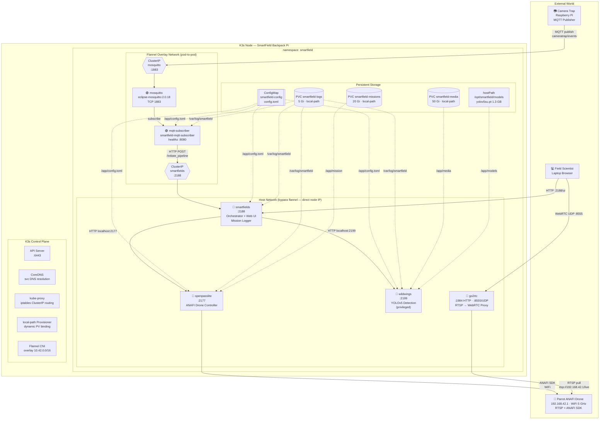
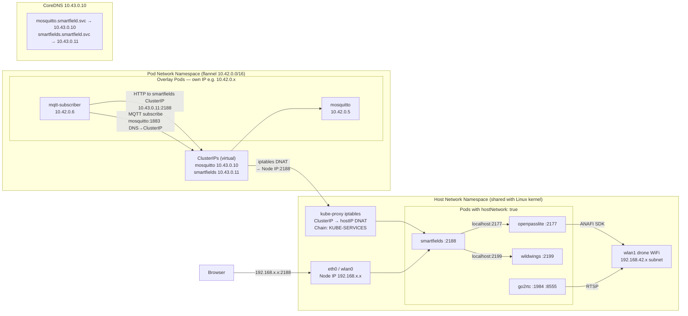
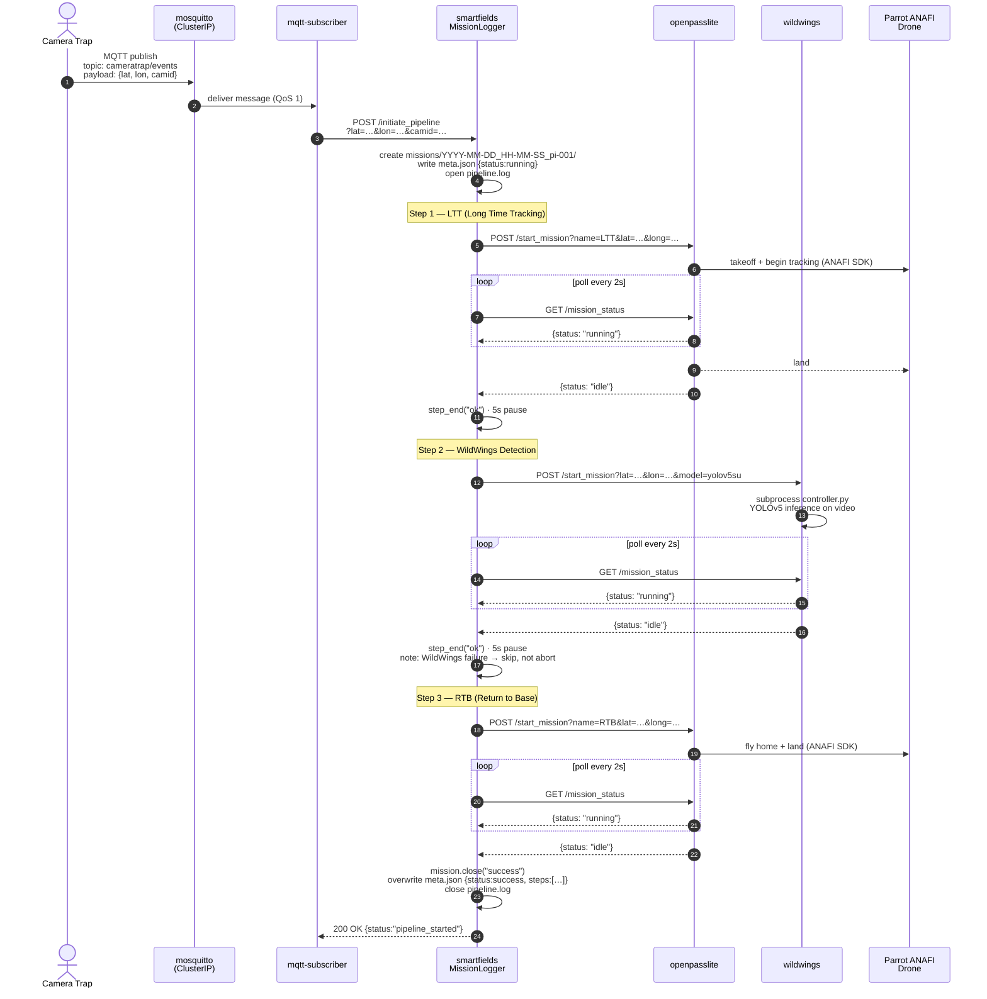
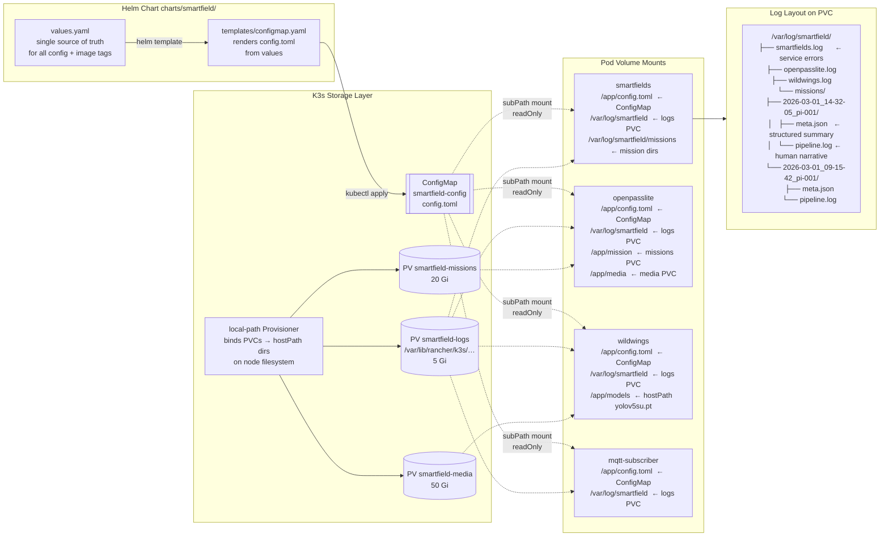

# SmartField Backpack — Systems Architecture

> Single-node K3s cluster running on a Raspberry Pi field backpack.
> Five diagrams, each zooming into a different layer of the system.

---

## 1. Full System Overview

Who talks to whom, and over what protocol.

---

## 2. Network Topology — hostNetwork vs Flannel

The most important networking concept in this deployment.

**Key insight:** `hostNetwork: true` gives a pod the node's real network interfaces.
kube-proxy's iptables rules (`KUBE-SERVICES` chain) live in the host network namespace,
so ClusterIP routing still works — mqtt-subscriber can reach the smartfields ClusterIP,
which DNAT-rewrites to the node IP, landing in the smartfields pod. No overlay needed.

---

## 3. Mission Pipeline — Sequence

Full lifecycle from camera-trap MQTT event to RTB completion.

---

## 4. Storage & Configuration Architecture

How config and data flow through persistent volumes.

---

## 5. Kubernetes Resource Map

Every K3s object and how they relate.

```mermaid
flowchart TB
    subgraph HELM2["Helm Release: smartfield"]
        direction LR
        CHART["charts/smartfield/\nChart.yaml v1.1.0\nvalues.yaml"]
    end

    subgraph NS2["namespace: smartfield"]

        subgraph DEPLOYMENTS["Deployments  (strategy: Recreate)"]
            D1["Deployment\nmosquitto"]
            D2["Deployment\nmqtt-subscriber"]
            D3["Deployment\nsmartfields\nhostNetwork"]
            D4["Deployment\nopenpasslite\nhostNetwork + privileged"]
            D5["Deployment\nwildwings\nhostNetwork + privileged"]
            D6["Deployment\ngo2rtc\nhostNetwork"]
        end

        subgraph PODS["Pods  (1 replica each — single node)"]
            P1["Pod  mosquitto-xxxx"]
            P2["Pod  mqtt-subscriber-xxxx"]
            P3["Pod  smartfields-xxxx"]
            P4["Pod  openpasslite-xxxx"]
            P5["Pod  wildwings-xxxx"]
            P6["Pod  go2rtc-xxxx"]
        end

        subgraph SERVICES["Services  (ClusterIP)"]
            S1{{"mosquitto\n:1883"}}
            S2{{"smartfields\n:2188"}}
        end

        subgraph PVCS["PersistentVolumeClaims"]
            C1[("smartfield-logs\n5 Gi  RWO")]
            C2[("smartfield-missions\n20 Gi  RWO")]
            C3[("smartfield-media\n50 Gi  RWO")]
        end

        subgraph CMS["ConfigMaps"]
            CM3[["smartfield-config\nconfig.toml"]]
            GO2_CM[["go2rtc-config\ngo2rtc.yaml"]]
        end

        subgraph PROBES["Liveness Probes"]
            PR1["HTTP GET /healthz :2177\nopenpasslite"]
            PR2["HTTP GET /healthz :2188\nsmartfields"]
            PR3["HTTP GET /healthz :2199\nwildwings"]
            PR4["TCP  :8080\nmqtt-subscriber"]
            PR5["TCP  :1883\nmosquitto"]
            PR6["TCP  :1984\ngo2rtc"]
        end

    end

    CHART -->|"renders + applies"| DEPLOYMENTS
    CHART -->|"renders + applies"| PVCS & CMS & SERVICES

    D1 -->|"owns"| P1
    D2 -->|"owns"| P2
    D3 -->|"owns"| P3
    D4 -->|"owns"| P4
    D5 -->|"owns"| P5
    D6 -->|"owns"| P6

    S1 -->|"selector: app=mosquitto"| P1
    S2 -->|"selector: app=smartfields"| P3

    CM3  -.->|"volume"| P2 & P3 & P4 & P5
    GO2_CM -.->|"volume"| P6
    C1   -.->|"volume"| P2 & P3 & P4 & P5
    C2   -.->|"volume"| P4
    C3   -.->|"volume"| P5

    PR1 -.->|"monitored by kubelet"| P4
    PR2 -.->|"monitored by kubelet"| P3
    PR3 -.->|"monitored by kubelet"| P5
    PR4 -.->|"monitored by kubelet"| P2
    PR5 -.->|"monitored by kubelet"| P1
    PR6 -.->|"monitored by kubelet"| P6
```

---

## Component Reference

| Pod | Image | Network | Ports | Role |
|---|---|---|---|---|
| mosquitto | eclipse-mosquitto:2.0.18 | Flannel overlay | 1883/TCP | MQTT broker — event bus |
| mqtt-subscriber | smartfield-mqtt-subscriber | Flannel overlay | 8080/TCP (health) | Bridges MQTT events → smartfields HTTP |
| smartfields | smartfield-smartfields | **hostNetwork** | 2188/TCP | Pipeline orchestrator + web dashboard |
| openpasslite | smartfield-openpasslite | **hostNetwork + privileged** | 2177/TCP | ANAFI drone controller (LTT, RTB) |
| wildwings | smartfield-wildwings | **hostNetwork + privileged** | 2199/TCP | YOLOv5 bird detection |
| go2rtc | ghcr.io/alexxit/go2rtc | **hostNetwork** | 1984/TCP + 8555/UDP | RTSP → WebRTC proxy for live feed |

## Why hostNetwork on 4 of 6 Pods?

The Parrot ANAFI drone creates a WiFi access point on `192.168.42.x`. Kubernetes's overlay
network (Flannel) cannot route to this subnet — it only manages the `10.42.0.0/16` pod CIDR.
Pods with `hostNetwork: true` bypass Flannel entirely and share the node's network interfaces,
giving them direct access to the drone WiFi and the ability to open real host ports
(2177, 2188, 2199, 1984, 8555) that the field scientist's browser and camera traps can reach
without an Ingress controller or NodePort service.

The ClusterIP Services for mosquitto and smartfields still work for the overlay pods
(mqtt-subscriber) because kube-proxy's iptables rules live in the host network namespace
and apply to all connections regardless of which network namespace originates them.
